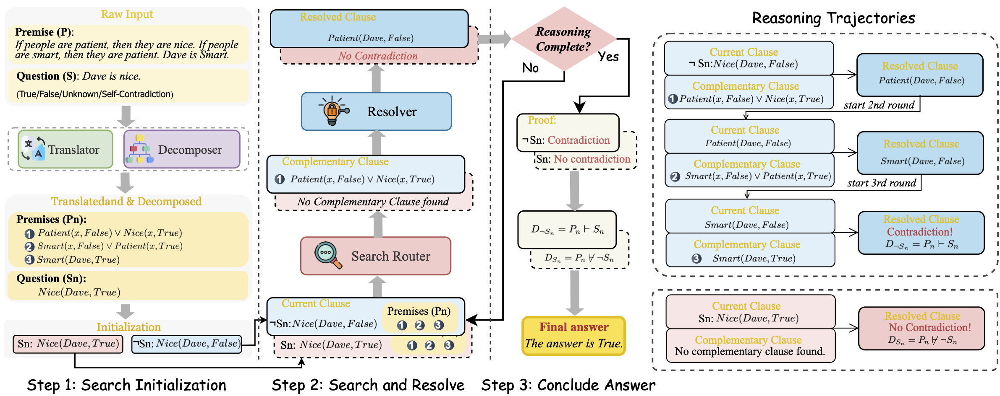

# Taken From Aristotle

Codes and Data for ACL 2025 Paper [**"Aristotle: Mastering Logical Reasoning with A Logic-Complete Decompose-Search-Resolve Framework"**](<https://arxiv.org/abs/2412.16953>)

Author: [**Jundong Xu**](<https://aiden0526.github.io/>)<sup>1</sup>, [**Hao fei**](<https://haofei.vip/>)<sup>1</sup><sup>*</sup> (Corresponding author), [**Meng Luo**](https://eurekaleo.github.io/)<sup>1</sup>, [**Qian Liu**](<https://profiles.auckland.ac.nz/liu-qian>)<sup>2</sup>, [**Liangming Pan**](<http://www.liangmingpan.com/>)<sup>3</sup>, [**William Yang wang**](<https://sites.cs.ucsb.edu/~william/>)<sup>4</sup>, [**Preslav Nakov**](<https://mbzuai.ac.ae/study/faculty/preslav-nakov/>)<sup>5</sup>, [**Mong-Li Lee**](https://www.comp.nus.edu.sg/cs/people/leeml/)<sup>1</sup>, [**Wynne Hsu**](https://www.comp.nus.edu.sg/cs/people/whsu/)<sup>1</sup>

<sup>1</sup> National University of Singapore, <sup>2</sup> University of Auckland, <sup>3</sup> University of Arizona, <sup>4</sup> University of California, Santa Barbara, <sup>5</sup> MBZUAI

**Introduction**
-----
In the context of large language models (LLMs), current advanced reasoning methods have made impressive strides in various reasoning tasks. However, when it comes to logical reasoning tasks, significant challenges remain in both efficacy and efficiency. This is rooted in the fact that these systems fail to fully leverage the inherent structure of logical tasks throughout the reasoning processes, including decomposition, search, and resolution. To address this, this paper proposes a logic-complete reasoning framework, Aristotle. The framework consists of three key components: Logical Decomposer, Logical Search Router, and Logical Resolver, in which symbolic expressions and logical rules are comprehensively integrated into the entire reasoning process, significantly alleviating the bottlenecks of logical reasoning, i.e., reducing sub-task complexity, minimizing search errors, and resolving logical contradictions. Experimental results demonstrate that Aristotle consistently outperforms state-of-the-art reasoning frameworks in both accuracy and efficiency, particularly excelling in complex logical reasoning scenarios.



**Setup**
------
Please install all the required packages first by running the following command:
```
pip install -r requirements.txt
```

**Translation and Decomposition**
-----
To use Aristotle for logical inference, we first need to prepare the data by translating and decomposing it, as illustrated in Step 1 of the figure.

Please run the following command to do that:
```
python translate_decompose.py \
    --api_key "Your API Key" \
    --model_name "Model Name [gpt-4 | gpt-4o]" \
    --data_path "./data" \
    --dataset_name "Dataset [ProntoQA | ProofWriter | LogicNLI]" \
    --split dev \
    --max_new_tokens 6144 \
    --batch_num "Number of batches to execute in parallel"
```
The results will be saved in the ```./results```.

**Initialization**
-----
We need to initialize two search paths for the reasoning task before starting the search. Run the command below to perform the initialization:
```
python negate.py \
    --dataset_name "Dataset [ProntoQA | ProofWriter | LogicNLI]" \
    --model "Model Name [gpt-4 | gpt-4o]"
```
After successful initialization, a JSON file with the suffix "negated_data" will be generated in the ```./results```.

**Search and Resolve**
-----
At this stage, as shown in **Step 2** of the figure, we perform **search and resolve** on two reasoning paths (corresponding to two JSON files): one with the suffix `"no_negation"` and the other with `"negated_data"`.

To complete this step, run the command below **twice**, setting `--negation` to `True` for one run and `False` for the other.
```
python search_resolve.py \
    --api_key "Your API Key" \
    --model_name "Model Name [gpt-4 | gpt-4o]" \
    --data_path "./data" \
    --dataset_name "Dataset [ProntoQA | ProofWriter | LogicNLI]" \
    --split dev \
    --negation "Run on negated data [True | False]" \
    --max_new_tokens 4096 \
    --batch_num "Number of batches to execute in parallel"
```
After sucessfully finishing the search and resolve, two result files will be generated in the ```./results```, corresponding to two search path with suffix `"search_negation_True"` and `"search_negation_False"`.

**Conclusion and Evaluation**
-----
We now have the results of two search path, so we can conclude the final answer by aggregating the result of two path using the formular (1) as shown in the paper.
Please run the below command to conclude and evaluate the answer.
```
python evaluate.py \
    --dataset_name "Dataset [ProntoQA | ProofWriter | LogicNLI]" \
    --model "Model Name [gpt-4 | gpt-4o]"
```

**Citation**
-----
Please cite the paper if you use this framework during your research.
```
@inproceedings{Aristotle25,
  author       = {Jundong Xu and
                  Hao Fei and
                  Meng Luo and
                  Qian Liu and
                  Liangming Pan and
                  William Yang Wang and
                  Preslav Nakov and
                  Mong{-}Li Lee and
                  Wynne Hsu},
  title        = {Aristotle: Mastering Logical Reasoning with {A} Logic-Complete Decompose-Search-Resolve Framework},
  booktitle    = {Proceedings of the 63rd Annual Meeting of the Association for Computational Linguistics},
  year         = {2025},
  url          = {https://arxiv.org/abs/2412.16953}
}
```